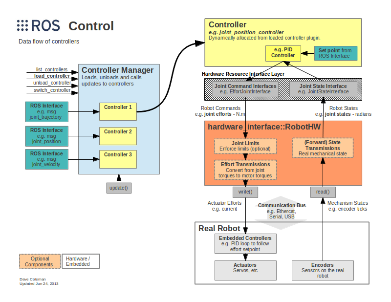

The packages for hardware interfaces, hardware drivers, control, robot model description, microcontroller scripts, moveit configure files, and deviation correction plugin.
# Software famework
We use Robotic Operate System (ROS Noetic Ninjemys), an open-source robotics middleware suite, for robot software development. A set of packages that include controller interfaces, controller managers, transmissions, and hardware interfaces called ros_control are applied. The ros_control packages take as input the joint state data from the robot's actuator's encoders and an input set point. It uses a generic control loop feedback mechanism, a PID controller, to control the joint position outputs.
## About ar3_hardware_interface, ar3_hardware_driver, gripper_hardware_interface and gripper_hardware_driver
The ar3 and gripper hardware Interfaces are used by ros_ control in conjunction with position_controllers with the help of ar3 and gripper drivers to send and receive commands to the Arduino Mega 2560, Teensy 3.5 or Teensy 4.1 by Boost.Asio which is a C++ library with a consistent asynchronous I/O model for commanding position-based joints.

(Credit: http://wiki.ros.org/ros_control)

The motion planning framework called MoveIt has access to the ros_control nodes, the ar3 and gripper hardware interfaces, through a plugin called MoveItControllerManager. For trajectory calculation, the KDL kinematics plugin of MoveIt wraps around the numerical inverse kinematics solver provided by the Orocos KDL package are used, which only works with serial chains. Rviz is the primary visualizer in ROS. The MoveIt Rviz plugin allows us to set up virtual environments, create start and goal states for the robot interactively, test various motion planners, and visualize the output.
