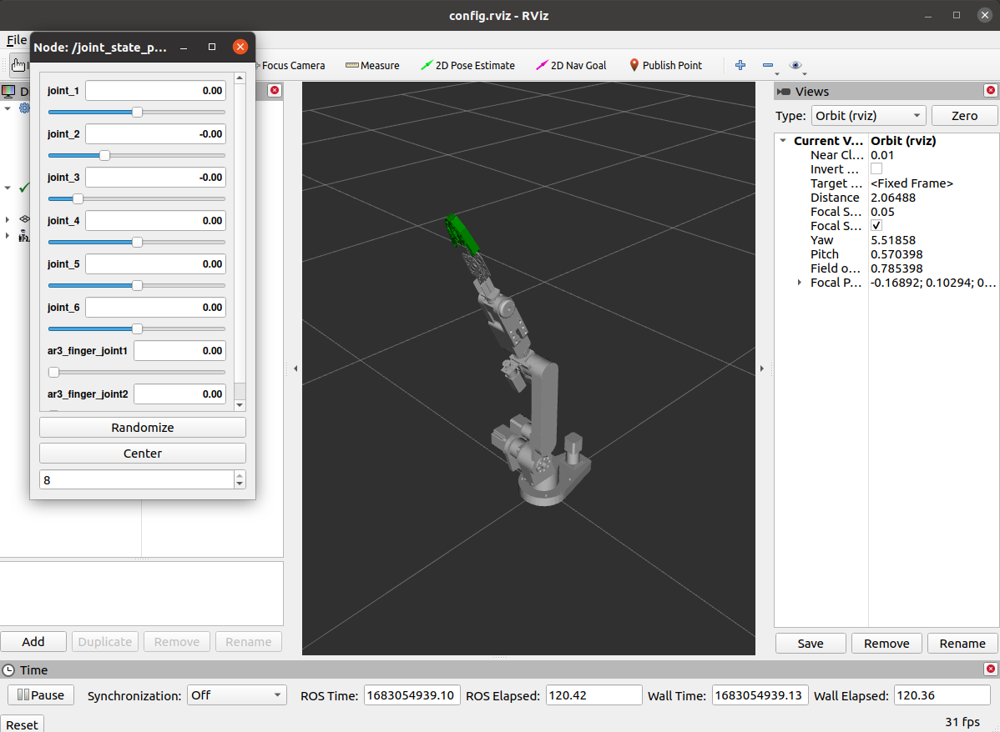

# cobot_description
The “cobot_description” packages reserves all 3D model information of Cobot including ar3 and gripper. Rviz helps users check 3D models and joint settings.

## Instruction to check 3D models and joint settings by Rviz
* Open a new terminal and change the directory path to catkin_ros workspace
* Run
```
source ./devel/setup.bash
```
* Run
```
roslaunch cobot_description rviz.launch
```
, then two new windows appear as shown below:

The “Node: /joint_state_publisher_gui – Joint State Publisher” provides 8 bars controlling the rotation and prismatic motion of joints in the 3D model of the Rviz.
Enter Ctrl C on the terminal to exit the program.
