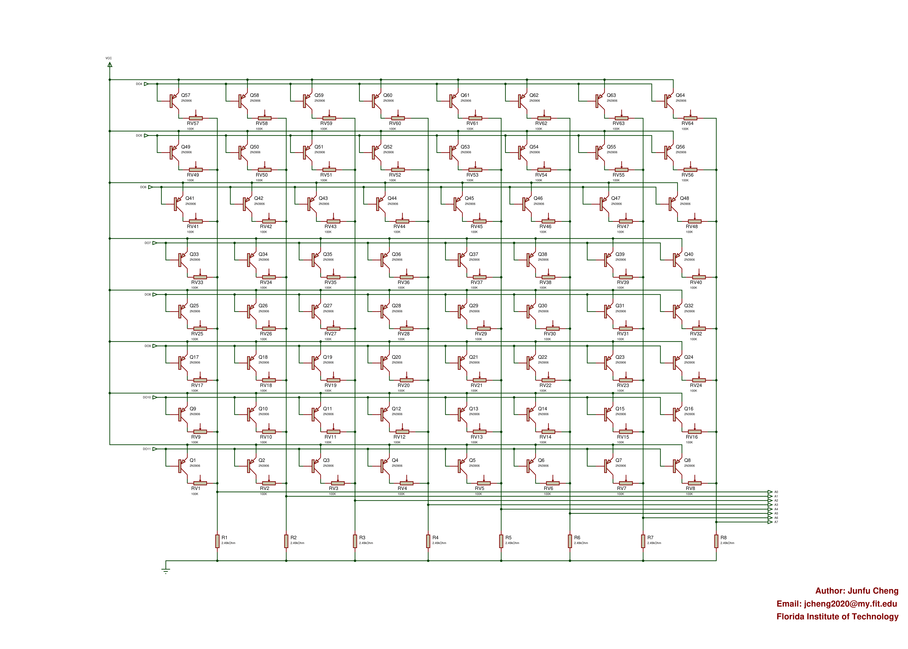
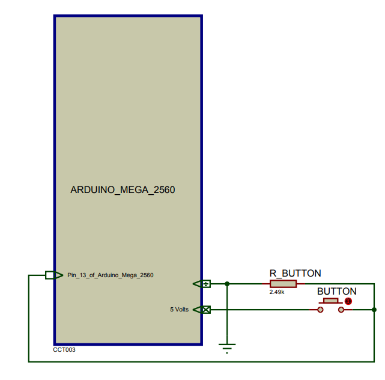

An independent workspace “catkin_ros_chessboard” to reserve all Arduino Mega 2560 scripts required to drive the sensor chessboard and chess engine-related subprograms in the chess_player package for the chess player function of the Cobot.
## The circuit diagram for the sensor chessboard main part:

## The circuit diagram for the sensor chessboard button part:

**The main part circuit and the button part circuit of the chessboard are common ground.**
